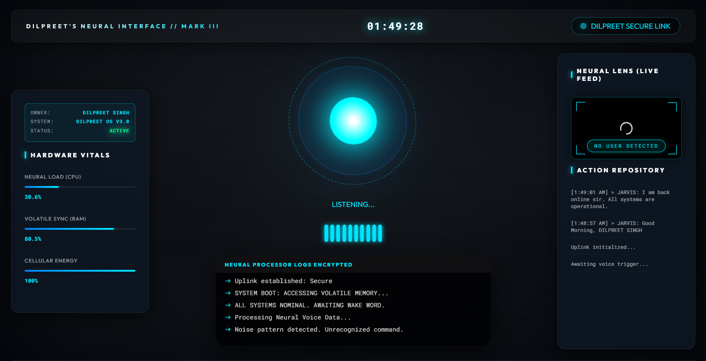

# 🤖 JARVIS Prototype 2 - Neural Interface v3.0

Welcome to **JARVIS Prototype 2**, a high-end, voice-activated AI assistant designed with a futuristic sci-fi HUD. This project integrates multiple AI brains, facial recognition security, and real-time hardware monitoring.



## ✨ Key Features
- **Dual-Brain Logic**: Real-time switching between **Google Gemini 2.0** and **Groq (Llama 3)**.
- **Biometric Security**: Facial landmark-based authentication to "Wake Up" JARVIS.
- **Neural Lens**: Live camera feed with presence detection.
- **Advanced HUD**: Real-time CPU, RAM, and Battery vitals.
- **Voice Commands**: Control volume, brightness, take screenshots, search the web, play music, and more.
- **Multilingual Support**: JARVIS can speak in English, Hindi, and Punjabi.

## 🚀 Getting Started

### 1. Clone the Repository
```bash
git clone https://github.com/DilpreetSinghVerma/Jarvis-0.2.git
cd Jarvis-0.2
```

### 2. Set Up Environment
Create a `.env` file in the root directory and add your keys (refer to `.env.example`):
```env
USER="Your Name"
BOT="JARVIS"
GEMINI_API_KEY="your_key_here"
GROQ_API_KEY="your_key_here"
NEWS_API_KEY="your_key_here"
WEATHER_API_KEY="your_key_here"
```

### 3. Install Dependencies
It is recommended to use a virtual environment:
```bash
python -m venv .venv
source .venv/bin/activate  # On Windows: .venv\Scripts\activate
pip install -r requirements.txt
```
*(Note: If requirements.txt is missing, you may need to install modules like eel, pyttsx3, SpeechRecognition, mediapipe, opencv-python, and decouple manually.)*

### 4. Facial Training
Before you can wake up JARVIS, you must train the biometric scanner:
```bash
python train_face.py
```

### 5. Launch the System
```bash
python main.py
```

## 🛠 Tech Stack
- **Backend**: Python (Eel, OpenCV, MediaPipe, SpeechRecognition)
- **Frontend**: HTML5, CSS3 (Glassmorphism & Neon UI), JavaScript
- **AI Models**: Gemini 2.0 Flash, Llama 3.3 (via Groq)

## 👤 Author
**Dilpreet Singh**
- GitHub: [@DilpreetSinghVerma](https://github.com/DilpreetSinghVerma)

---
*Note: This project is for educational purposes and personal use. Ensure you handle your API keys securely.*
