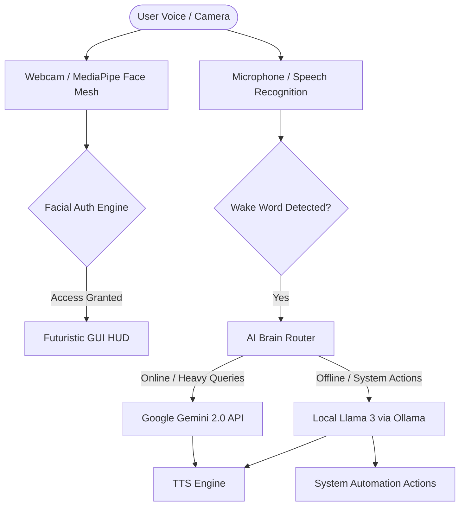

# 🤖 JARVIS AI Assistant

<div align="center">


[](https://www.python.org/)
[](https://ai.google.dev/)
[](https://mediapipe.dev/)
[](LICENSE)

**Voice-activated sci-fi virtual assistant with facial biometric authentication and a dual-brain AI system.**  
*Powered by Gemini 2.0 & Llama 3.*

</div>

---

## 🌌 Overview

**JARVIS** is a voice-activated smart assistant designed with a futuristic, sci-fi HUD interface. It goes beyond simple voice commands by combining real-time camera tracking (facial biometrics) with a hybrid AI system (Local Llama 3 + Cloud Gemini 2.0) to deliver a highly secure, offline-capable desktop utility interface.

---

## ✨ Key Features

- **🛡️ Biometric Face Login:** Uses OpenCV and Google MediaPipe to scan and verify your face before activating system access.
- **🧠 Dual-Brain Orchestrator:**
  - **Primary Brain:** Cloud-based **Gemini 2.0** for deep analytical reasoning, coding tasks, and multi-modal queries.
  - **Fallback / Local Brain:** Offline **Llama 3** (via Ollama) to execute system commands, file navigation, and manage actions securely without an internet connection.
- **🎙️ Voice & Wake Word Activation:** Custom offline wake-word engine ("Jarvis") that listens actively with minimal CPU usage.
- **🚀 System Control Engine:** Lock screen, check hardware thermals, launch apps, search files, control media playback, and read system diagnostics out loud.
- **🛸 Futuristic Sci-Fi HUD:** Interactive GUI dashboard displaying real-time audio waveforms, face landmarks tracking overlay, and system stats.

---

## 🛠️ System Architecture


```mermaid
graph TD
    User([User Voice / Camera]) --> Mic[Microphone / Speech Recognition]
    User --> Cam[Webcam / MediaPipe Face Mesh]
    
    Cam --> Auth{Facial Auth Engine}
    Auth -->|Access Granted| HUD[Futuristic GUI HUD]
    
    Mic --> WakeWord{Wake Word Detected?}
    WakeWord -->|Yes| BrainRouter[AI Brain Router]
    
    BrainRouter -->|Online / Heavy Queries| Gemini[Google Gemini 2.0 API]
    BrainRouter -->|Offline / System Actions| Llama[Local Llama 3 via Ollama]
    
    Gemini --> TextToSpeech[TTS Engine]
    Llama --> TextToSpeech
    Llama --> SysControl[System Automation Actions]
```

- **Core Engine:** Python 3.9+
- **Computer Vision:** OpenCV, Google MediaPipe (Face Mesh & Tracking)
- **Large Language Models:** Google GenAI API (Gemini), Ollama API (Llama 3)
- **Speech Processing:** SpeechRecognition, pyttsx3 (offline TTS)
- **UI GUI:** Custom Tkinter / Pygame (fluid UI with waveform renders)

---

## 📦 Installation & Setup

1. **Clone the repository:**
   ```bash
   git clone https://github.com/DilpreetSinghVerma/Jarvis-0.2.git
   cd Jarvis-0.2
   ```

2. **Create a virtual environment:**
   ```bash
   python -m venv venv
   # On Windows:
   venv\Scripts\activate
   # On macOS/Linux:
   source venv/bin/activate
   ```

3. **Install dependencies:**
   ```bash
   pip install -r requirements.txt
   ```

4. **Install and run Ollama (for offline Llama 3 processing):**
   - Download Ollama from [ollama.com](https://ollama.com)
   - Pull the Llama 3 model:
     ```bash
     ollama pull llama3
     ```

5. **Set up credentials:**  
   Create a `.env` file in the project root:
   ```env
   GEMINI_API_KEY=your_google_gemini_api_key
   ```

6. **Start JARVIS:**
   ```bash
   python main.py
   ```

---

## 🤝 Connect

- Portfolio: [dilpreet-webresume.vercel.app](https://dilpreet-webresume.vercel.app)
- Email: [dilpreetsinghverma@gmail.com](mailto:dilpreetsinghverma@gmail.com)
- LinkedIn: [Dilpreet Singh](https://linkedin.com/in/dilpreet-singh-709b35310)
